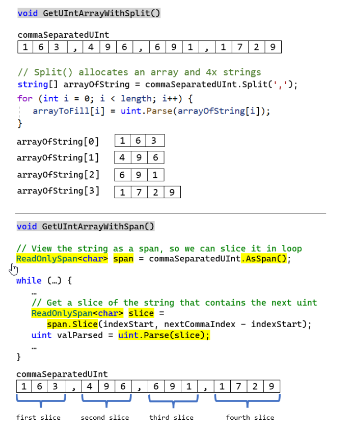

# Introduction

Let’s use Span<T> to obtain an array of uint from the string "163,496,691,1729".

Without Span<T> one would use "163,496,691,1729".Split(','). 
This call allocates four strings and an array to reference these four strings. Then uint.Parse(string) is used to parse each sub-string.

With Span<T> (actually with ReadOnlySpan<char> because the content of a string is immutable) the input string gets sliced into four spans. 
Because ReadOnlySpan<T> is a structure, each span is concretely a few bytes added on the current thread stack. 
Stack allocation is super fast and the GC is not impacted by values allocated on the stack. 
Then uint.Parse(ReadOnlySpan<char>) is used to parse each slice.

#  ref struct

Span<T> is declared as a **ref struct**. A structure marked with ref, is a special structure that can only live on the thread stack. This way it can hold a managed pointer as a field (ref field explained above). The feature ref struct was released with C# 7.2 just to make the implementation of Span<T> upon a managed pointer possible. If the .NET team did all this efforts this is because a Span<T> implementation based on managed pointer has significant advantages

# Memory<T>

The structure Memory<T> is similar to Span<T> but without the ref struct restrictions. It can be used as a field of a class for example

# Links

https://blog.ndepend.com/improve-c-code-performance-with-spant/

https://blog.ndepend.com/managed-pointers-span-ref-struct-c11-ref-fields-and-the-scoped-keyword/