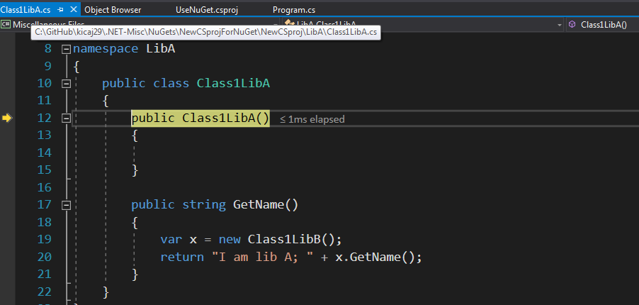

- [Throw vs ThrowEx](#throw-vs-throwex)
- [CovarianceAndContravariance](#covarianceandcontravariance)
- [??](#)
- [Old csproj vs new csproj](#old-csproj-vs-new-csproj)
  - [OldCSproj](#oldcsproj)
  - [NewCSproj](#newcsproj)
  - [CSProjDotNetStandardAndConsolAppCore](#csprojdotnetstandardandconsolappcore)
- [NuGets](#nugets)
  - [NuGets for .NET Framework old csproj](#nugets-for-net-framework-old-csproj)
  - [NuGets for .NET Framework new csproj](#nugets-for-net-framework-new-csproj)
    - [Top-level dependencies](#top-level-dependencies)
    - [PrivateAssets](#privateassets)
    - [ExternalReferences - nuget dependencies](#externalreferences---nuget-dependencies)
    - [TargetsForTfmSpecificBuildOutput](#targetsfortfmspecificbuildoutput)
    - [TargetsForTfmSpecificContentInPackage](#targetsfortfmspecificcontentinpackage)
  - [Use nuget that contains *dacpacs*](#use-nuget-that-contains-dacpacs)
  - [Floating versioning](#floating-versioning)
  - [Debugging](#debugging)
    - [Simulation of not loading pdb files for locally compiled dlls](#simulation-of-not-loading-pdb-files-for-locally-compiled-dlls)
    - [Function Breakpoint](#function-breakpoint)
    - [Object Browser - Go To Implementation](#object-browser---go-to-implementation)
    - [DebugType embedded](#debugtype-embedded)
  - [Managing Package Versions Centrally](#managing-package-versions-centrally)
- [Expression trees](#expression-trees)
  - [Expression trees basics](#expression-trees-basics)
    - [Expression trees advanced](#expression-trees-advanced)
- [ConsoleAppConfigFile](#consoleappconfigfile)
- [var vs dynamic vs object](#var-vs-dynamic-vs-object)
- [boxing and unboxing](#boxing-and-unboxing)
- [CORS](#cors)
- [Anonymous Types](#anonymous-types)
- [Discards](#discards)
- [Deconstruct](#deconstruct)
- [CultureInfoExamples](#cultureinfoexamples)

# Throw vs ThrowEx
throw ex - shorter stack trace   
throw - full stack trace

# CovarianceAndContravariance
https://stackoverflow.com/questions/2662369/covariance-and-contravariance-real-world-example   
https://docs.microsoft.com/en-us/dotnet/csharp/programming-guide/concepts/covariance-contravariance/index   
For example since .net 4.0 IEnumerable is Covariant!!! Using out/in you can define own types
that are covariant (casting up) or contravariant (casting down).

# ??
?? reacts only on null value, string.Empty is treated as not null value

# Old csproj vs new csproj
https://natemcmaster.com/blog/2017/03/09/vs2015-to-vs2017-upgrade/   

## OldCSproj
This is just simple .NET Framework project in .NET 4.6.1.   

## NewCSproj
This is project converter from OldCSproj where csproj files have been refactored to new csproj format.  

Notes:
* in new csproj AssemblyInfo.cs file is automatically generated and it is stored only in memory. Because in old csproj AssemblyInfo.cs was stored on disk the compiler sees 2 duplicated files and returns 7 errors. There are 2 options to solve it: remove the AssemblyInfo.cs from the disk or use *<GenerateAssemblyInfo>false</GenerateAssemblyInfo>* in the csproj file. More can be found [here](https://stackoverflow.com/questions/42138418/equivalent-to-assemblyinfo-in-dotnet-core-csproj).
* it looks that at least in case of console app if new csproj file is used it has to be used in all referenced projects. If some projects use old csproj there are errors during compilation.

## CSProjDotNetStandardAndConsolAppCore
This is project created for .NET Core 2.0 and libs are in .NET Standard 2.0.

# NuGets
## NuGets for .NET Framework old csproj
Folders: NuGetNETFramework, NuGetNETFrameworkRun.   
For old csproj .nuspec file is required.   
https://www.codeproject.com/Articles/1214420/Creating-a-Nuget-Package-Step-by-Step   
https://dotnetcore.gaprogman.com/2018/04/26/how-to-create-nuget-packages/   
## NuGets for .NET Framework new csproj
Folder: NewCSproj.   
For new csproj .nuspec file is not supported because nuget related data are avialble in csproj files.   

### Top-level dependencies
*In NuGet 2, you listed every single package to be included. In NuGet 4 (VS 2017), you only need to list top-level dependencies. Everything else is that those top-level dependencies require will be imported automatically.*   
**NOTE: the topic is about nuget dependencies and not dll references!!!**
https://natemcmaster.com/blog/2017/03/09/vs2015-to-vs2017-upgrade/   


https://docs.microsoft.com/en-us/dotnet/core/tools/csproj

### PrivateAssets
By default all referenced csproj are treated as nuget dependency.
It means that nuget A will have dependency to nuget B. In presented case there is only one nuget that contains dlls A, B, C so to not create nuget dependency to not existing nuget B tag *PrivateAssets* has to be used.   
```
<ProjectReference PrivateAssets="All" Include="..\LibB\LibB.csproj" />
```   
### ExternalReferences - nuget dependencies
In case nuget package (LibA) contains dll (LibB.csproj) which has reference to dll from another package (LibD) **we have to add reference to nuget** LibD in LibA.csproj (root csproj for nuget LibA).   

```
  <ItemGroup Label="ExternalReferences">
    <PackageReference Include="LibD" Version="1.0.1" />
  </ItemGroup>
```

Also then in the client project we can see this nuget dependency in Solution Explorer.


If the nuget reference is not added then client that uses nuget LibA will get an error.

```
System.IO.FileNotFoundException: 'Could not load file or assembly 'LibD, Version=1.0.0.0, Culture=neutral, PublicKeyToken=null' or one of its dependencies. The system cannot find the file specified.'
```
### TargetsForTfmSpecificBuildOutput
To include in the nuget additionall dlls element *TargetsForTfmSpecificBuildOutput* has to be used.   

NOTE: this tag is needed even *csproj* references are used! It means that if *csproj* A has reference to *csproj* B to have dll B for the nuget A it has to explicit added via *TargetsForTfmSpecificBuildOutput*.

```
<TargetsForTfmSpecificBuildOutput>PackageAdditionalBuildOutput</TargetsForTfmSpecificBuildOutput>
```

```
  <Target Name="PackageAdditionalBuildOutput">
    <ItemGroup>
      <BuildOutputInPackage Include="..\LibB\bin\debug\LibB.dll" />
      <BuildOutputInPackage Include="..\LibB\bin\debug\LibC.dll" />
    </ItemGroup>
  </Target>
```

### TargetsForTfmSpecificContentInPackage
This element allows to add any other files that should be placed in the nuget. It can be used e.g. to include *dacpac* files.

## Use nuget that contains *dacpacs*
Because after adding dependency to a nuget that contains *dacpac* files the files are not automatically added to the current solution/project it has to be done manually or by some script. *Dacpac* files have to be uncpack from the nuget and copied to some folder in the current solution/project.   

In *UseNuGet.sln* was created folder *NugetContent* for stuff like *dacpac* files. In this case it was copied manually. Next this *dacpac* can be referenced by other *sqlproj* files from the current solution.   

NOTE: remember about handling an issue with not executing pre-deployment and pos-deployment scripts from the referenced *dacpac* files (also from the referenced *sqlproj* files). More info about it can be found in the [sql repo](https://github.com/kicaj29/sql#how-to-reference-between-sqlproj-files).   
## Floating versioning
[Docs](https://docs.microsoft.com/en-us/nuget/consume-packages/dependency-resolution#floating-versions).   

[Docs2](https://docs.microsoft.com/en-us/nuget/reference/package-versioning#version-ranges-and-wildcards).

## Debugging
To debug selected dll we have to make sure that pdb (symbols) file of the selected dll is loaded in run-time.   

[Where does the debugger search for symbol files?](https://docs.microsoft.com/en-us/visualstudio/debugger/specify-symbol-dot-pdb-and-source-files-in-the-visual-studio-debugger?view=vs-2017#BKMK_Find_symbol___pdb__files)   
*   The location that is specified inside the DLL or the executable file.
*   .pdb files that are present in the same folder as the DLL or executable file.
*   Any locations [specified in the debugger options](https://docs.microsoft.com/en-us/visualstudio/debugger/specify-symbol-dot-pdb-and-source-files-in-the-visual-studio-debugger?view=vs-2017#BKMK_Specify_symbol_locations_and_loading_behavior) for symbol files.   

It means that if the dll that we are referencing was compiled on our local machine then the pdb files will be loaded automatically. To simulate not loading .pdb files for locally compiled dlls we have to change path to the place where the dll was compiled or simple delete this pdb file.

NOTE: when you downloaded the DLLs from another source, such as a nuget package, and you want to debug the code in this DLL select option [Suppress JIT optimization on module load (Managed only)](https://docs.microsoft.com/en-us/visualstudio/debugger/jit-optimization-and-debugging?view=vs-2017) in debugger options view.

[Where the debugger searches for source files](https://docs.microsoft.com/en-us/visualstudio/debugger/specify-symbol-dot-pdb-and-source-files-in-the-visual-studio-debugger?view=vs-2017#BKMK_Where_the_debugger_searches_for_source_files)

NOTE: like mentioned in the above link the .pdb file also contains path to the local path where the dll/pdb were build. Below is presented sample pdb content (generated by dotPeek tool).

```
<?xml version="1.0" encoding="utf-8"?>
<Pdb Name="LibA" Path="C:\Users\jacek.kowalski\.nuget\packages\liba\2.0.0-rc.4\lib\net461\LibA.pdb" AssemblyPath="C:\Users\jacek.kowalski\.nuget\packages\liba\2.0.0-rc.4\lib\net461\LibA.dll" PdbType="Portable" Signature="17eb40c5-1c11-4cfc-aa81-d600fb0657fa" TimeDateStamp="2452160015" AgeOrTimestampFromAssembly="2452160015 0 " SignatureFromAssembly="17eb40c5-1c11-4cfc-aa81-d600fb0657fa 00000000-0000-0000-0000-000000000000 " PdbFileFromAssembly="C:\GitHub\kicaj29\.NET-Misc\NuGets\NewCSprojForNuGet\NewCSproj\LibA\obj\Debug\net461\LibA.pdb - ">
  <UserEntryPoint>null</UserEntryPoint>
  <Document Index="1" DocumentType="Text" Language="C#" LanguageVendor="Microsoft">C:\GitHub\kicaj29\.NET-Misc\NuGets\NewCSprojForNuGet\NewCSproj\LibA\Class1LibA.cs</Document>
  <ImportScope Index="1" Parent="null" />
  <ImportScope Index="2" Parent="1">
    <Import>System</Import>
    <Import>System.Collections.Generic</Import>
    <Import>System.Linq</Import>
    <Import>System.Text</Import>
    <Import>System.Threading.Tasks</Import>
    <Import>LibB</Import>
  </ImportScope>
  <ImportScope Index="3" Parent="2" />
  <Method Token="6000001" LocalVariablesSignatureToken="11000000">
    <SequencePoints DocumentIndex="1">
      <SequencePoint IlOffset="IL_0000" StartLine="12" StartColumn="9" EndLine="12" EndColumn="28" />
      <SequencePoint IlOffset="IL_0007" StartLine="13" StartColumn="9" EndLine="13" EndColumn="10" />
      <SequencePoint IlOffset="IL_0008" StartLine="15" StartColumn="9" EndLine="15" EndColumn="10" />
    </SequencePoints>
    <Scope OffsetRange="IL_0000-IL_0009" IsRoot="True" Method="6000001" ImportScope="3" />
  </Method>
  <Method Token="6000002" LocalVariablesSignatureToken="11000001">
    <SequencePoints DocumentIndex="1">
      <SequencePoint IlOffset="IL_0000" StartLine="18" StartColumn="9" EndLine="18" EndColumn="10" />
      <SequencePoint IlOffset="IL_0001" StartLine="19" StartColumn="13" EndLine="19" EndColumn="38" />
      <SequencePoint IlOffset="IL_0007" StartLine="20" StartColumn="13" EndLine="20" EndColumn="49" />
      <SequencePoint IlOffset="IL_001a" StartLine="21" StartColumn="9" EndLine="21" EndColumn="10" />
    </SequencePoints>
    <Scope OffsetRange="IL_0000-IL_001c" IsRoot="True" Method="6000002" ImportScope="3">
      <Scope OffsetRange="IL_0000-IL_001c" IsRoot="False" Method="6000002" ImportScope="3">
        <LocalVariable LocalVariablesSignatureToken="11000001" IlIndex="0" Attributes="None">x</LocalVariable>
      </Scope>
    </Scope>
  </Method>
  <Type Name="LibA.Class1LibA">
    <File>C:\GitHub\kicaj29\.NET-Misc\NuGets\NewCSprojForNuGet\NewCSproj\LibA\Class1LibA.cs</File>
  </Type>
</Pdb>
```

### Simulation of not loading pdb files for locally compiled dlls
1. Rename folder with sources of the dlls that will be included in the nuget package to some temp name e.g. *NewCSproj_tempName*.
2. Build the dlls and create nuget package. Pdb files will have path that has in name *NewCSproj_tempName*.
3. Place the nuget package to some local folder.
4. Revert rename to original name *NewCSproj* (it might require closing all VS to do it).
5. Run UseNuGet.sln and use the nuget that was created in step 2.
6. When the application runs the symbols for the dlls A, B, C are not loaded
which is weird because documentation says *.pdb files that are present in the same folder as the DLL or executable file*.


More [here](https://docs.microsoft.com/en-us/visualstudio/debugger/specify-symbol-dot-pdb-and-source-files-in-the-visual-studio-debugger?view=vs-2017).

7. Load pdb files manually (use option *Load Symbols* from the context menu in *Modules* view).


8. Run the app once again. Now if we will try enter to constructor *Class1LibA* (StepInto: F11) popup window will appear to point where is the cs file for this class. If we point the correct place with this source file we will be able enter into constructor and debug it.

   



### Function Breakpoint
Another option of debugging is usage of *Function Breakpoint...*
.   

To use this option copy the function name in Object Browser and next pase it in the *Function Breakpoint...*.

.  

.  

In this way we can start debugging pointed function.   

.  

### Object Browser - Go To Implementation
At this moment I do not know how to get working this option...
.  

### DebugType embedded
In case there is a need to embed pdb files inside dlls then can be used option *DebugType*

```
<DebugType>embedded</DebugType>
```
This option has to be used in every csproj that produces dll that goes into nuget package. When this option is used option
*IncludeSymbols* should be removed from the csproj.

```
<IncludeSymbols>true</IncludeSymbols>
```

NOTE: I cannot find any official docs for the *embedded DebugType*. [Here](https://docs.microsoft.com/en-us/visualstudio/msbuild/common-msbuild-project-properties?view=vs-2017#list-of-common-properties-and-parameters) can be found some information but on the list of values for the *DebugType* are only *full*, *pdbonly*, and *none*.

App that loads dlls with embedded symbols loads automatically the symbols.


## Managing Package Versions Centrally

Create projects:
```
dotnet new sln -n CentralNuGets
dotnet new console -o myapp
dotnet new classlib -o mylib1
dotnet new classlib -o mylib2
dotnet sln CentralNuGets.sln add mylib1\mylib1.csproj
dotnet sln CentralNuGets.sln add mylib2\mylib2.csproj
```

Add sample references to nugets:
```
dotnet add mylib1/mylib1.csproj package Newtonsoft.Json -v 13.0.1
dotnet add mylib2/mylib2.csproj package Newtonsoft.Json -v 13.0.0
```

Add references to projects:
```
dotnet add myapp/myapp.csproj reference mylib1\mylib1.csproj mylib2\mylib2.csproj
```

[Managing Package Versions Centrally](./NuGets/ManagingPackageVersionsCentrally)

Links:   
https://docs.microsoft.com/en-us/visualstudio/msbuild/customize-your-build?view=vs-2019   
http://code.fitness/post/2018/03/directory-build-props.html   
https://www.codementor.io/@rowlandbanks/lets-fix-your-c-project-structure-13om1krhqz   

# Expression trees
## Expression trees basics
https://www.codeproject.com/Articles/17575/Lambda-Expressions-and-Expression-Trees-An-Introdu

*The C# compiler can generate expression trees only from expression lambdas (or single-line lambdas). It cannot parse statement lambdas (or multi-line lambdas).* More [here](https://docs.microsoft.com/en-us/dotnet/csharp/programming-guide/concepts/expression-trees/#creating-expression-trees-from-lambda-expressions).   

*Statement lambdas, like anonymous methods, cannot be used to create expression trees.* More [here](https://docs.microsoft.com/en-us/dotnet/csharp/programming-guide/statements-expressions-operators/lambda-expressions#statement-lambdas)
### Expression trees advanced
http://www.pashov.net/code/dynamic+filters

# ConsoleAppConfigFile
If we have some dll that has own App.config then the app setting key has to be added to the App.config from the exe/main csproj to access in runtime value of this key.

# var vs dynamic vs object
https://www.c-sharpcorner.com/UploadFile/b1df45/var-vs-dynamic-keywords-in-C-Sharp/   
https://www.c-sharpcorner.com/UploadFile/rohatash/difference-between-object-and-dynamic-keyword-in-C-Sharp/   
https://docs.microsoft.com/en-us/archive/blogs/csharpfaq/what-is-the-difference-between-dynamic-and-object-keywords   
https://devblogs.microsoft.com/visualstudio/what-is-the-difference-between-dynamic-and-object-keywords/
https://code-maze.com/advanced-csharp-dynamic-type/


* change value after assignment
  * object: possible
    ```
      object o = 999;
      o = "aaa";
    ```
  * var: not possible
    ```
      var i = 999;
      i = "aaaa"; //compilation error!!!
    ```

  * dynamic: possible
    ```
    dynamic d = 999;
    d = "aaa";
    ```
* intellisense
  * object: available for methods from ```class Object```
  * var: available for the used type
  * dynamic: not available (but dynamic works with anonymous types)
    ```
      dynamic address = new
      {
          City = "Katowice",
          Street = "Mikolowska"
      };
    ```
    If we type ```address.``` then nothing appears in the intellisense
* value returned by a function
  * object: object can be used to return value and also can be a parameter
    ```
    public static object returnObject()
    {
        object o = "123";
        return o;
    }  
    ```
  * var: var cannot be used as returned typed and also cannot be used are parameter. Only local usage is possible.  
    The following code will not compile:
    ```
    public static var returnVar()
    {
        var s = "abc";
        return s;
    }
    ```
    But this is ok:
    ```
    public static string returnString()
    {
        var s = "abc";
        return s;
    }    
    ```
  * dynamic: can be used are returned type and as parameters also
    ```
    public static dynamic returnDynamic(dynamic x)
    {
        if (x)
        {
            dynamic val1 = new
            {
                Name = "Jacek",
                Age = 21
            };
            return val1;
        }
        else
        {
            dynamic val2 = new
            {
                Gender = "male",
                Salary = 2000
            };
            return val2;
        }
    }    
    ```
  * used as property/field type
    * object: possible
    * var: not possible
    * dynamic: possible
  ```
  public class SimpleClass
  {
      object FieldObject;
      // var FieldVar; // will not compile
      dynamic FieldDynamic;

      object PropertyObject { get; set; }
      // var PropertyVar { get; set; } // will not compile
      dynamic PropertyDynamic { get; set; }
  }
  ```
* dynamic vs object
  > ["As part of the process, variables of type dynamic are compiled into variables of type object. Therefore, type __dynamic exists only at compile time, not at run time__."](https://docs.microsoft.com/en-us/dotnet/csharp/language-reference/builtin-types/reference-types)
  ```
  dynamic dyn = 1;
  object obj = 1;

  Debug.WriteLine((string)dyn.GetType().Name);    // prints Int32
  Debug.WriteLine(obj.GetType().Name);            // prints Int32  

  dyn = dyn + 3;                                  // 4
  // obj = obj + 3; // compilation error  
  ```
* when to use dynamic
  * if we have to multiple times cast object (or another type) then to write less lines of code we can use dynamic
  * communicating with other dynamic languages
  * simplifying responses from API calls when we don’t know what type of object to expect (or we don’t care)
  * creating libraries that can be used between languages
  * making generic solutions when speed isn’t the main concern
  * replacing and simplifying reflection code
* Why we shouldn’t use dynamic all the time because:
  * It’s slower than statically typed code
  * Increases a chance to get runtime exceptions
  * Decreases code readability in some cases, and working with it is a bit harder due to the lack of IntelliSense

# boxing and unboxing
https://gurunguns.wordpress.com/2012/10/14/stack-heap-value-types-reference-types-boxing-and-unboxing/   
   


>BOXING: When we move data from Value type to Reference type, data is moved from Stack to Heap. It is termed as Boxing.

>UNBOXING: When we move data from Reference type to Value type, data is moved from Heap to stack. It is termed as Unboxing

# CORS
Run server and client to see how to enable/disable/control CORS.

CORS: includes protocol, domain, port. http://localhost:5500 is not equal to http://127.0.0.1:5500

# Anonymous Types
https://docs.microsoft.com/en-us/dotnet/csharp/programming-guide/classes-and-structs/anonymous-types   

>"Anonymous types provide a convenient way to encapsulate a set of read-only properties into a single object without having to explicitly define a type first."

* Can we add a method to an anonymous type: NO
https://stackoverflow.com/questions/24770648/can-we-add-a-method-to-an-anonymous-type-that-refers-to-the-anonymous-types-mem
>"The reason is that anonymous types are intended to be transient so that you can deal with the results of projections in a concise manner, without having to create an explicit type to hold the results of transforming and projecting a set of data"

# Discards

https://docs.microsoft.com/en-us/dotnet/csharp/discards

> "Starting with C# 7.0, C# supports discards, which are placeholder variables that are intentionally unused in application code. Discards are equivalent to unassigned variables; they don't have a value. A discard communicates intent to the compiler and others that read your code: You intended to ignore the result of an expression. You may want to ignore the result of an expression, one or more members of a tuple expression, an out parameter to a method, or the target of a pattern matching expression."

[discards-example](./Discards)

# Deconstruct

> "C# does not offer built-in support for deconstructing non-tuple types. However, as the author of a class, a struct, or an interface, you can allow instances of the type to be deconstructed by implementing one or more Deconstruct methods. The method returns void, and each value to be deconstructed is indicated by an out parameter in the method signature. For example, the following Deconstruct method of a Person class returns the first, middle, and last name"

```c#
public void Deconstruct(out string fname, out string mname, out string lname)
```

[deconstruct-example](./Discards/Discards/Person.cs#L28)

https://docs.microsoft.com/en-us/dotnet/csharp/deconstruct#deconstructing-user-defined-types


# CultureInfoExamples

[CultureInfoExamples](./CultureInfoExamples)

https://docs.microsoft.com/en-us/previous-versions/dotnet/articles/ms994325(v=msdn.10)?redirectedfrom=MSDN#the-turkish-example
https://stackoverflow.com/questions/3550213/in-c-sharp-what-is-the-difference-between-toupper-and-toupperinvariant

   
>NOTE: to see a difference on the screen a font that properly renders these characters must be used! That`s why the same example is rendered differently on Console and WinForms apps because they use different fonts!